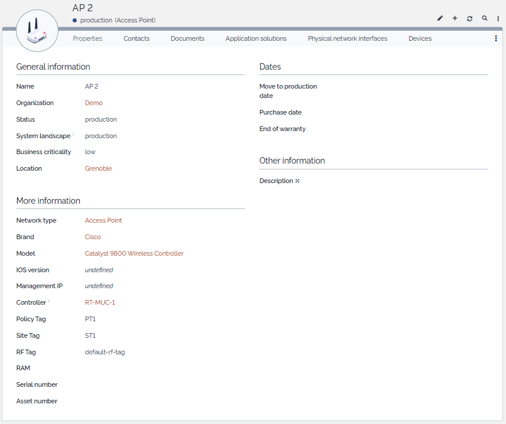

# iTop-br-accesspoint

Copyright (c) 2024 Björn Rudner

## What?

Add Class for Access Points

This extension will create a new NetworkDeviceType "Access Point" (if not already there).

NetworkDeviceType "Access Point" will be preselected when creating a new Access Point.

### Screenshot iTop 3.1

## Dependencies

## iTop Compatibility

The extension was tested on iTop 2.7.10 and 3.1.1

## Attribution

This Extension uses Icons from:

[Access Point Icon](https://www.flaticon.com/free-icons/access-point) Access point icons created by smashingstocks - Flaticon
